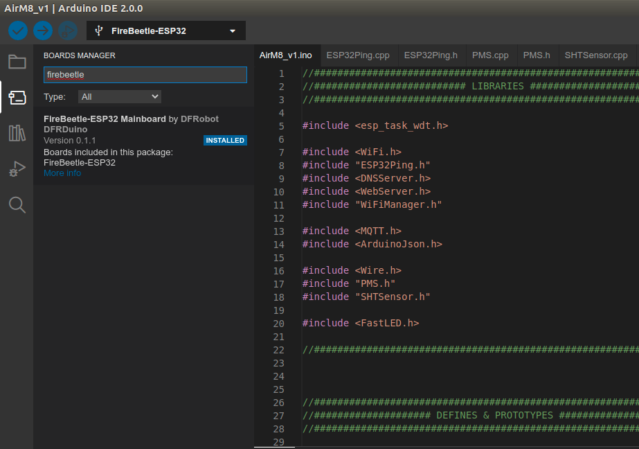
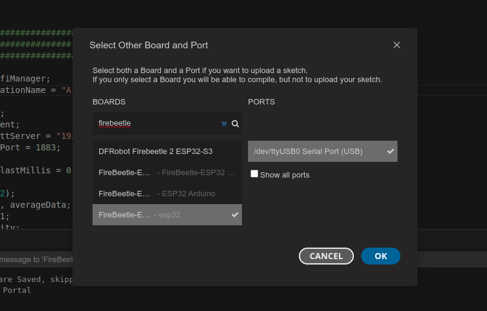

# AirM8


## Introduction.

AirM8 is a community project that has the aim of enhancing the awareness about air quality.
In particular, the focus is on domestic indoor air quality.

We often care very much about the quality of the air we breath when we are outside of our house.
However, we spend most our time inside of our buildings. Why should we not understand better our environment?
That is especially valid in winter season usually.

So, the project is an IoT system which takes data on:
- Temperature
- Humidity
- Particulate metters.

The system then upload the data in a server and data are saved in a local database.
The server provides you with both a dashboard to monitor the data and a software to create your own automation at home is values reach some threshold.

## IoT sensing node.

The IoT sensing node is powered by an ESP32.
In particular, it was chosen the Firebeetle ESP32-E for that is a board which might enable very low energy consumption.
(This might turn useful in other projects).

Here you can find the wiki page: https://wiki.dfrobot.com/FireBeetle_Board_ESP32_E_SKU_DFR0654

Temperature and humidity are measured by a Sensirion SHT20.
Datasheet here: https://sensirion.com/media/documents/CCDE1377/635000A2/Sensirion_Datasheet_Humidity_Sensor_SHT20.pdf

This device was chosen because proved to be reliable and easy to interface.

Particulate matters are measured by a Plantower PMS7003.

Datasheet here: https://aqicn.org/air/sensor/spec/pms7003-english-v2.5.pdf

More info here: https://aqicn.org/sensor/pms5003-7003/

SHT31 is interfaced via I2C, while PMS7003 is interfaced via TTL Serial.
Please find here below the connections.


The folder named "ESP32_code" contains the Arduino IDE code for the IoT sensing node.
Data exchange happens via Wi-Fi, which is configured via wifimanager.

PMS7003 and SHT31 are polled every 10 minutes, the rest of the time the system stays in deep sleep.

The measuring routine starts with 30 seconds of free air flow and that it takes 10 measures.
The result is the average of the measures, which are then pubblished via MQTT.

## Firmware upload

The tool used for the firmware upload is Arduino IDE 2.0, downloadable from here: https://www.arduino.cc/en/software 
Once downloaded the tool it is needed to import some libraries to make the IDE work with ESP32 boards. To do so you can add the following links for development boards download:

http://arduino.esp8266.com/stable/package_esp8266com_index.json
https://raw.githubusercontent.com/DFRobot/FireBeetle/master/package_DFRobot_index.json
https://raw.githubusercontent.com/espressif/arduino-esp32/gh-pages/package_esp32_dev_index.json

To add the link you can paste them in File -> Preferences -> Additional board manager URLs (last line). See picture below:


Once you have added the link, the Arduino IDE is able to download the required specification to work with the ESP32 board we are looking for: Firebeetle ESP32.
So, click on the left side to the board manager and search for "firebeetle". Then install the boards as shown in the pictures below:



Now you can open the project file. After downloading the firmware from the folder "ESP32_code" from the repo, you can open the project file named "AirM8_v1.ino".
Connect the ESP32 board to the PC and make sure that the board is recognized by the PC and the right COM port is selected. Please see picture below:



Before uploading the firmware it is requeste to customize your sensor node to make sure you can easily connect to the server part. So, pay attention to the "Global Variable" part and change the following two variables:
* const char* stationName
* const char* mqttServer

Please put your name, or any identifier in the station name and please replace the IP address of the mqttServer with the one provided to you. See the picture below as a reference:


Then, you are ready to compile the firmware by clicking the first button in the top menu bar. You should expect an output as the one in the picture below.


Then you can upload the firmware to the ESP32 by clicking the second button in the top menu bar. You should expect an output as the one in the picture below.


After confirming the update was successfull, reset the device by plugging out and in the USB cable. The device should start the sensing operation even without any configuration after 5 minutes. The lights on the device should change accordingly to the quality of the air:

* GREEN : PM10 <25ug/m3
* YELLOW: 25ug/m3 < PM10 < 50 ug/m3
* RED	: PM10 > 50 ug/m3
* BLUE	: Measuring ongoing


## Server.

The server part is configured by taking inspiration from the following article: https://dzone.com/articles/raspberry-pi-iot-sensors-influxdb-mqtt-and-grafana.

The hardware part was chosen to be an Orange PI Zero 2 because of the limited availability of Raspberry PIs.

You can start by setting a static IP to your server by following these instructions: https://www.albertogonzalez.net/how-to-set-a-static-ip-on-armbian/

On the board there are few software that route, elaborate and show the data:
- Mosquitto (MQTT Broker)
- Node-red (NodeJS graphical programming enviroment for data routing and automation)
- InfluxDB (Database particularly useful for time series)
- Grafana (Easy-to-configure dashboarding software)

The full architecture is shown below:


You can install the single elements by follwing the instruction below:
- NODERED: 	https://nodered.org/docs/getting-started/raspberrypi
- Mosquitto:https://randomnerdtutorials.com/how-to-install-mosquitto-broker-on-raspberry-pi/
- InfluxDB:	https://docs.influxdata.com/influxdb/v1.8/introduction/install/
- Grafana:	https://grafana.com/docs/grafana/latest/setup-grafana/installation/debian/
(when Grafana is installing please use the following code: sudo apt-get install grafana=6.7.3.
Reference here: https://community.grafana.com/t/upgrade-from-latest-6-7-to-7-0-0-on-ubuntu-18-04-lts/30472/5)

For simplicity, here below all the steps are described with the relative commands:
#### Nodered

```
bash <(curl -sL https://raw.githubusercontent.com/node-red/linux-installers/master/deb/update-nodejs-and-nodered)

sudo systemctl enable nodered.service
```
Nodered requires the following additional nodes that you can intall from the palette manager:
- node-red-contrib-hysteresis
- node-red-contrib-influxdb

Then you can import the flow stored in the repo at the folder: NodeRed_Flow.

#### Mosquitto

```
sudo apt install -y mosquitto mosquitto-clients

sudo systemctl enable mosquitto.service

mosquitto -v
```

#### InfluxDB

```
wget -q https://repos.influxdata.com/influxdata-archive_compat.key

echo '393e8779c89ac8d958f81f942f9ad7fb82a25e133faddaf92e15b16e6ac9ce4c influxdata-archive_compat.key' | sha256sum -c && cat influxdata-archive_compat.key | gpg --dearmor | sudo tee /etc/apt/trusted.gpg.d/influxdata-archive_compat.gpg > /dev/null

echo 'deb [signed-by=/etc/apt/trusted.gpg.d/influxdata-archive_compat.gpg] https://repos.influxdata.com/debian stable main' | sudo tee /etc/apt/sources.list.d/influxdata.list

sudo apt update

sudo apt install influxdb
```
Then, you can configure InfluxDB. After the installation you need to create the database to host the data.
Run in the terminal the following commands:
```
influx
CREATE DATABASE airm8db
SHOW DATABASES
exit
```
And you should see your new database present.

#### Grafana
```
sudo apt-get install -y apt-transport-https

sudo apt-get install -y software-properties-common wget

sudo wget -q -O /usr/share/keyrings/grafana.key https://apt.grafana.com/gpg.key

echo "deb [signed-by=/usr/share/keyrings/grafana.key] https://apt.grafana.com stable main" | sudo tee -a /etc/apt/sources.list.d/grafana.list

sudo apt-get update

sudo apt-get install grafana=6.7.3
sudo systemctl enable grafana-server.service
sudo systemctl start grafana-server
```

You can now configure Grafana. (password is admin/admin)
Start by adding the data source.
Select Influxdb source. The address will be http://localhost:8086. The database name will be "airm8db". Click "Save%Test".

Then you can add a Dashboard.

data test:
{"PM1": 1,"PM25": 25,"PM10": 10,"TEMP": 20,"RH": 50}

https://github.com/DFRobot/FireBeetle-ESP32/blob/master/package_esp32_index.json
