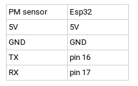
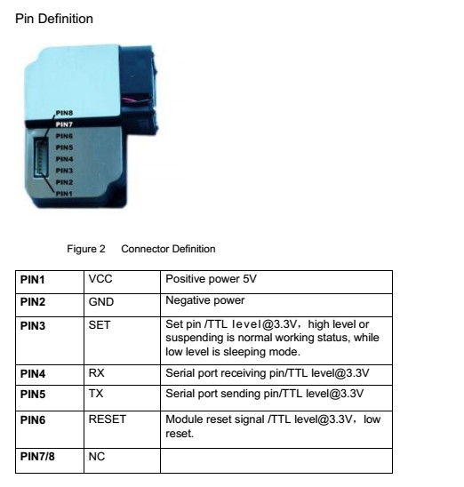
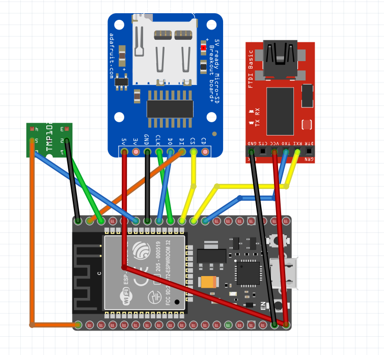
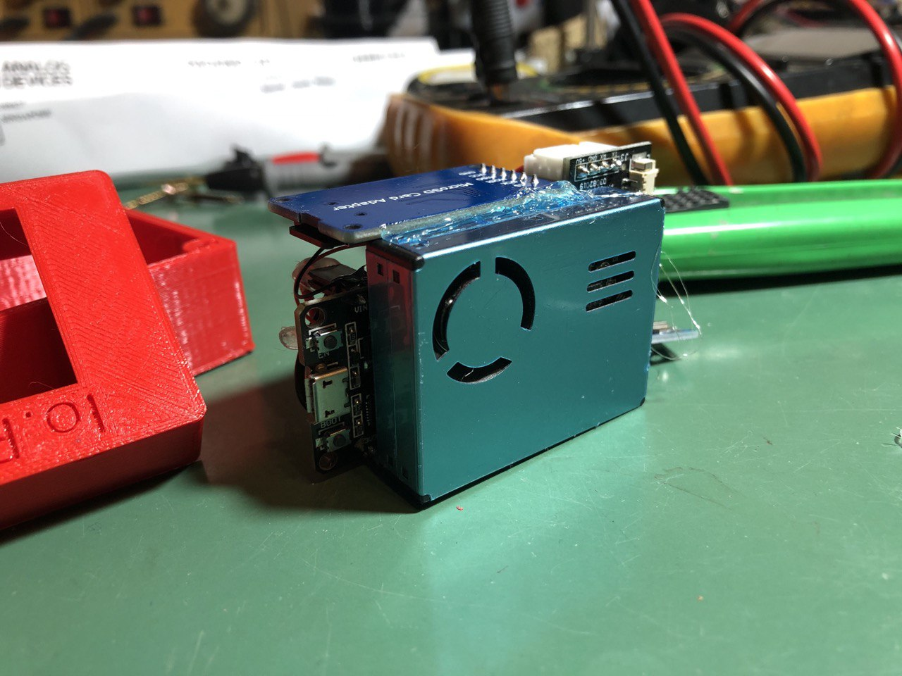
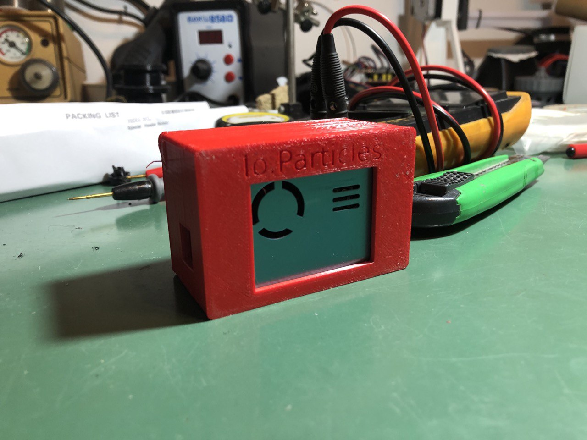
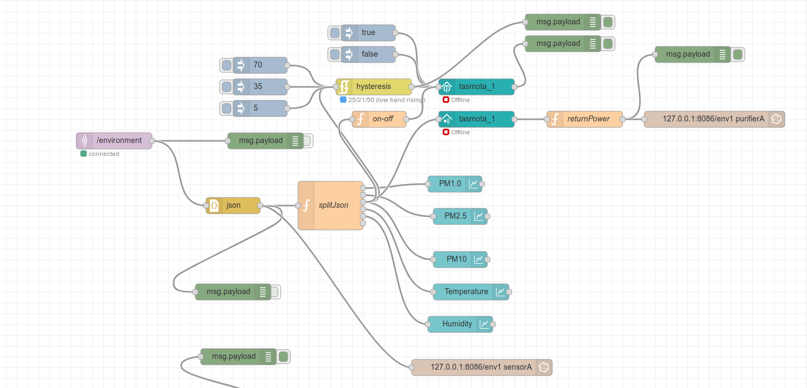
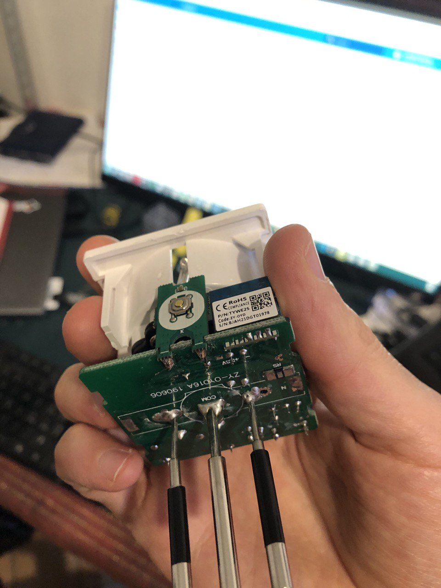
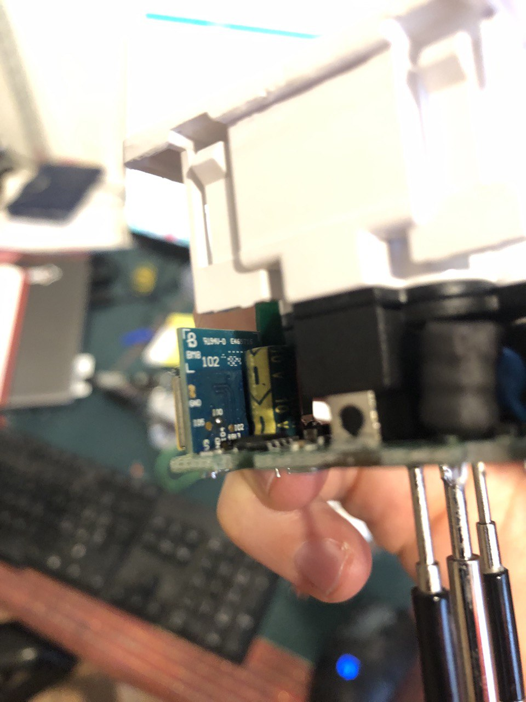
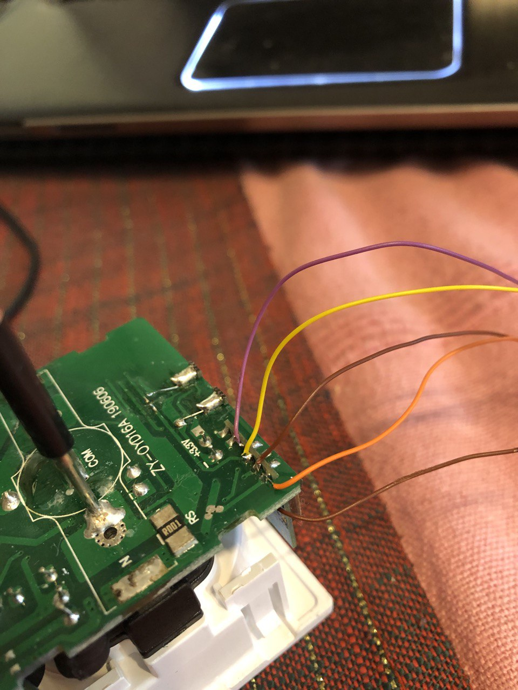
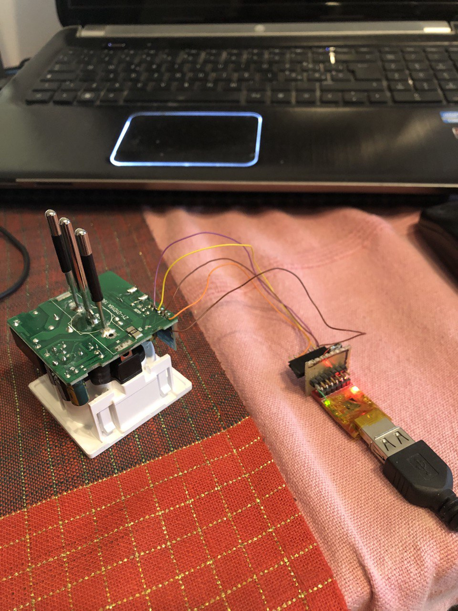

# PM10Visualizer

## Sensor and data acquisition

PM Logger contains source code to run PMS5003 with ESP32.
PMS5003 is polled every 10 minutes, the rest of the time the system stays in deep sleep.

The measuring routine starts with 60 seconds of free air flow and that it takes 10 measures.
The result is the average of the measure.

Temperature and Humidity are also measured through AHT10 sensor.

The result is pubblished via MQTT.

An MQTT broker is required on the network.

You have to set up your own SSID and password in the source code.

PM_logger_temtop does the same as just described.
The difference stays in the fact that the PMS7003 is used instead.

PM_logger_temtop_SD does the same measurements. The difference stays in the fact thattt t t it it itt it does not pubblish anysthing.
Instead, it stores all the data to an SD card to be later analyzed.

Here a description in italian:

RIguardo le connessioni fra sensori ed ESP32 qui ci sono alcuni appunti:

Il sensore necessita di 4 collegamenti verso l'ESP32:

Nei documenti trovi il pinout del sensore che ti riporto comunque qui:

Il pinout dell'ESP32 dipende dal modulo che hai ma si trova molto semplicemente online.

Dentro alla cartella PM_sensor_datasheets potrebbero esserci informazioni utili.

Qui uno schema di fritzing delle connessioni:

Un paio di foto di uno dei dispositivi:

## Data routing and data visualization

L'ESP32 è solo il nodo sensore, poi questi dati devono essere raccolti, strasportati in un database ed essere visibili.

Per farlo ho fatto più o meno come descritto qui sotto:
https://dzone.com/articles/raspberry-pi-iot-sensors-influxdb-mqtt-and-grafana

Guarda questo schema:

L'ESP32 comunica in MQTT sulla rete in cui è connesso. Si tratta di una comunicazione POST e SUBSCRIPTION.
Ovvero l'ESP32 "urla" nella rete dei dati con un certo tag.
C'è un broker che ascolta tutti i dati.
Poi ci sono dei client che precedentemente hanno detto al broker "oh, se senti qualcosa con questo tag girami il messaggio".
Questo broker si chiama mosquitto.

Nel mio caso, il client che ascolta i messaggi con il tag "environemnt" che vengono mandati dai miei ESP32, è un'installazione di NodeRed.
(Quindi non ho usato Telegraf come nello schema sopra)
https://nodered.org/docs/getting-started/raspberrypi
Di cui ti ho già parlato ed anche tu hai già sentito parlare.
Ci sono tanti blocchi già pronti per l'utilizzo, tra cui anche quello per interfacciarsi con un broker MQTT (mosquitto).
https://cookbook.nodered.org/mqtt/connect-to-broker

Questo client raccoglie i dati e poi li spedisce ad un database.
COme database ho utilizzato un'installazione locale sulla raspberry di InfluxDB.
https://pimylifeup.com/raspberry-pi-influxdb/
Si tratta di un database specifico per le time-series (ovvero per i dati che sono sequenze temporali di valori, quindi perfetto per i sensori.)
Anche in questo caso è davvero semplice interfacciare nodered con influxdb:
https://diyprojects.io/node-red-tutorial-saving-mysensors-measurements-on-influxdb/#.Xms86ZnQhhE

Infine manca solo la parte di visualizzazione dei dati.
Per fare questo ho utilizzato Grafana, sempre installato su Raspberry pi.
https://pimylifeup.com/raspberry-pi-grafana/
E' un ambiente di dashboarding molto potente che si interfaccia direttamente con influx-db.
Ti permette di generare alert e di monitorare i dati semplicemente connettendo il database all'installazione di Grafana:
https://grafana.com/docs/grafana/latest/features/datasources/influxdb/

Infine rispondo alla tua domanda: ho utilizzato una raspberry pi perchè, come puoi ben capire, per raccogliere i dati il lato server deve rimanere sempre acceso.
Energicamente e comodaticamente parlando, lasciare il mio pc sempre acceso non è fattibile.
Visto che la Raspberry Pi Zero W consuma circa 1W mi sembrava la scelta più saggia sulla quale installare tutto il mio lato server.

Qui una visualizzazione del flusso Nodered:

Noterai che all'interno del flusso ci sono anche dei nodi Tasmota.
Questi sono utilizzati per controllare delle prese smart.
Quando un valore sopra la soglia di polveri sottili viene rilevato, allora la presa smart alimenta un filtro.
Si tratta di un filtro per le polveri sottili realizzato con il filtro di Xiaomi ed una ventola a 230V.

La presa smart in questione é la seguente:
https://www.amazon.it/dp/B0822T6PXW?ref=ppx_pop_mob_ap_share

Per flashare il custom firmware tasmota si puó utilizzare Tasmotizer seguendo questa guida:
https://tasmota.github.io/docs/Getting-Started/

Per poter flashare la presa bisogna dissaldare il filino che collega il pulsante ad uno dei GPIO (che é TX o RX non ricordo)
Per fare il flash bisogna smontare la presa e collegarsi direttamente ai pin di RX e TX con un USB-Serial converter.
https://github.com/ct-Open-Source/tuya-convert/issues/563

Il modulo su cui é basata quella presa é il tywe2s:
https://fccid.io/2ANDL-TYWE2S/User-Manual/Users-Manual-3596121

Qui viene fatto su una presa diversa, ma si puó prendere spunto:
https://hassiohelp.eu/2019/01/22/multipresa-houzetek-tasmota/

Importante il GPIO0 che va messo a massa per poter mettere il modulo in flash mode.

Il template da caricare nel firmware tasmota per la presa in questione é il seguente:
https://templates.blakadder.com/aunics_it.html

Un po' di foto del flash della presa:

