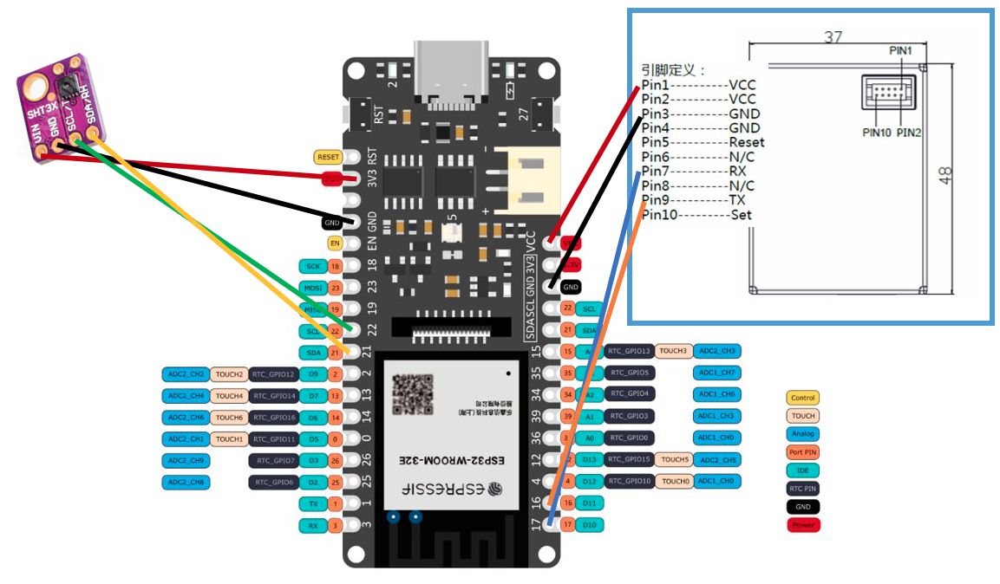

# AirM8

## Introduction.

AirM8 is a community project that has the aim of enhancing the awareness about air quality.
In particular, the focus is on domestic indoor air quality.

We often care very much about the quality of the air we breath when we are outside of our house.
However, we spend most our time inside of our buildings. Why should we not understand better our environment?
That is especially valid in winter season usually.

So, the project is an IoT system which takes data on:
- Temperature
- Humidity
- Particulate metters.

The system then upload the data in a server and data are saved in a local database.
The server provides you with both a dashboard to monitor the data and a software to create your own automation at home is values reach some threshold.

## IoT sensing node.

The IoT sensing node is powered by an ESP32.
In particular, it was chosen the Firebeetle ESP32-E for that is a board which might enable very low energy consumption.
(This might turn useful in other projects).

Here you can find the wiki page: https://wiki.dfrobot.com/FireBeetle_Board_ESP32_E_SKU_DFR0654

Temperature and humidity are measured by a Sensirion SHT20.
Datasheet here: https://sensirion.com/media/documents/CCDE1377/635000A2/Sensirion_Datasheet_Humidity_Sensor_SHT20.pdf

This device was chosen because proved to be reliable and easy to interface.

Particulate matters are measured by a Plantower PMS7003.

Datasheet here: https://aqicn.org/air/sensor/spec/pms7003-english-v2.5.pdf

More info here: https://aqicn.org/sensor/pms5003-7003/

SHT20 is interfaced via I2C, while PMS7003 is interfaced via TTL Serial.
Please find here below the connections.

The folder named "ESP32_code" contains the Arduino IDE code for the IoT sensing node.
Data exchange happens via Wi-Fi, which is configured via wifimanager.

PMS7003 and SHT20 are polled every 10 minutes, the rest of the time the system stays in deep sleep.

The measuring routine starts with 30 seconds of free air flow and that it takes 10 measures.
The result is the average of the measures, which are then pubblished via MQTT.

## Server.

The server part is configured by taking inspiration from the following article: https://dzone.com/articles/raspberry-pi-iot-sensors-influxdb-mqtt-and-grafana.

The hardware part was chosen to be an Orange PI Zero 2 because of the limited availability of Raspberry PIs.

You can start by setting a static IP to your server by following these instructions: https://www.albertogonzalez.net/how-to-set-a-static-ip-on-armbian/

On the board there are few software that route, elaborate and show the data:
- Mosquitto (MQTT Broker)
- Node-red (NodeJS graphical programming enviroment for data routing and automation)
- InfluxDB (Database particularly useful for time series)
- Grafana (Easy-to-configure dashboarding software)

The full architecture is shown below:

You can install the single elements by follwing the instruction below:
- NODERED: 	https://nodered.org/docs/getting-started/raspberrypi
- Mosquitto:https://randomnerdtutorials.com/how-to-install-mosquitto-broker-on-raspberry-pi/
- InfluxDB:	https://pimylifeup.com/raspberry-pi-influxdb/
- Grafana:	https://grafana.com/docs/grafana/latest/setup-grafana/installation/debian/
(when Grafana is installing please use the following code: sudo apt-get install grafana=6.7.3.
Reference here: https://community.grafana.com/t/upgrade-from-latest-6-7-to-7-0-0-on-ubuntu-18-04-lts/30472/5)

Nodered requires the following additional nodes that you can intall from the palette manager:
- node-red-contrib-hysteresis
- node-red-contrib-influxdb

Then you can import the flow stored in the repo at the folder: NodeRed_Flow.

Then, you can configure InfluxDB. After the installation you need to create the database to host the data.
Run in the terminal the following commands:

influx
CREATE DATABASE airm8db
SHOW DATABASES
exit

And you should see your new database present.

Now you can reboot the system with the command "reboot".

You can now configure Grafana.
Start by adding the data source.
Select Influxdb source. The address will be http://localhost:8086. The database name will be "airm8db". Click "Save%Test".

Then you can add a Dashboard.

