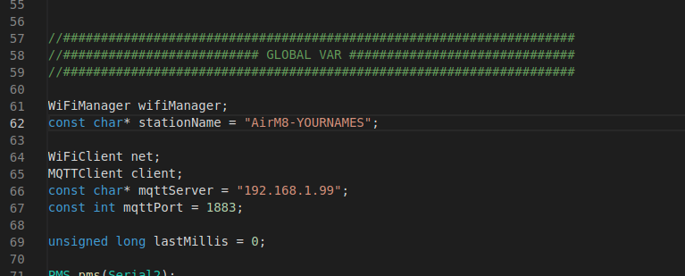
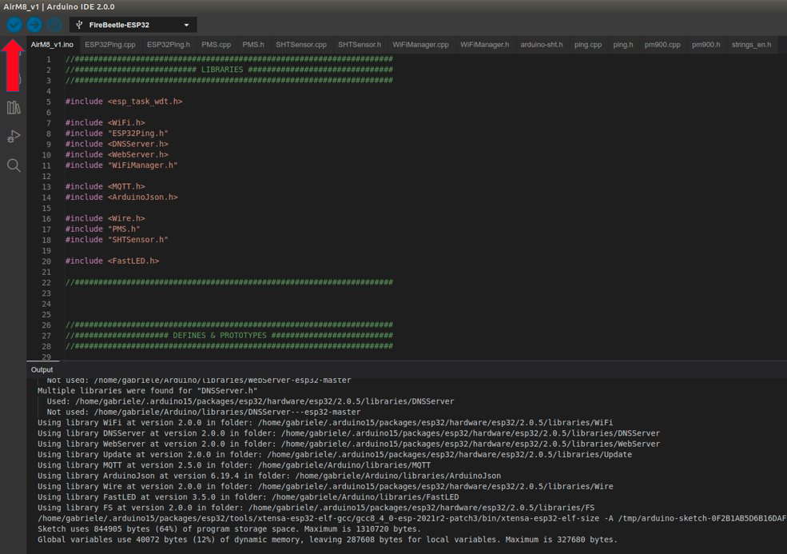

# AirM8


## Introduction.

AirM8 is a community project that has the aim of enhancing the awareness about air quality.
In particular, the focus is on domestic indoor air quality.

We often care very much about the quality of the air we breath when we are outside of our house.
However, we spend most our time inside of our buildings. Why should we not understand better our environment?
That is especially valid in winter season usually.

So, the project is an IoT system which takes data on:
- Temperature
- Humidity
- Particulate metters.

The system then upload the data in a server and data are saved in a local database.
The server provides you with both a dashboard to monitor the data and a software to create your own automation at home is values reach some threshold.


## IoT sensing node.

The IoT sensing node is powered by an ESP32.
In particular, it was chosen the Firebeetle ESP32-E for that is a board which might enable very low energy consumption.
(This might turn useful in other projects).

Here you can find the wiki page: https://wiki.dfrobot.com/FireBeetle_Board_ESP32_E_SKU_DFR0654

Temperature and humidity are measured by a Sensirion SHT20.
Datasheet here: https://sensirion.com/media/documents/CCDE1377/635000A2/Sensirion_Datasheet_Humidity_Sensor_SHT20.pdf

This device was chosen because proved to be reliable and easy to interface.

Particulate matters are measured by a Plantower PMS7003.

Datasheet here: https://aqicn.org/air/sensor/spec/pms7003-english-v2.5.pdf

More info here: https://aqicn.org/sensor/pms5003-7003/

SHT31 is interfaced via I2C, while PMS7003 is interfaced via TTL Serial.
Please find here below the connections.


The folder named "ESP32_code" contains the Arduino IDE code for the IoT sensing node.
Data exchange happens via Wi-Fi, which is configured via wifimanager.

PMS7003 and SHT31 are polled every 10 minutes, the rest of the time the system stays in deep sleep.

The measuring routine starts with 30 seconds of free air flow and that it takes 10 measures.
The result is the average of the measures, which are then pubblished via MQTT.

## Firmware upload

The tool used for the firmware upload is Arduino IDE 2.0, downloadable from here: https://www.arduino.cc/en/software 
Once downloaded the tool it is needed to import some libraries to make the IDE work with ESP32 boards. To do so you can add the following links for development boards download:

http://arduino.esp8266.com/stable/package_esp8266com_index.json
https://raw.githubusercontent.com/espressif/arduino-esp32/gh-pages/package_esp32_index.json

To add the link you can paste them in File -> Preferences -> Additional board manager URLs (last line). See picture below:


In the preferences also select verbose output both for "compile" and "upload" to receive more information that might be useful for debugging.
Once you have added the link, the Arduino IDE is able to download the required specification to work with the ESP32 board we are looking for: ESP32 board.
So, click on the left side to the board manager and search for "esp32". Then install the boards as shown in the pictures below:


Now you can open the project file. After downloading the firmware from the folder "ESP32_code" from the repo, you can open the project file named "AirM8_v1.ino".
Connect the ESP32 board to the PC and make sure that the board is recognized by the PC and the right COM port is selected. Please see picture below:


If your ESP32 is not recognized, you might miss the drivers. In this case please follow this link for the installation:
https://learn.sparkfun.com/tutorials/how-to-install-ch340-drivers/all

Then you are required to install some libraries from the library manager on the left side:
* MQTT
* Arduinojson
* Fastled
* WiFiManager

Please see below the references:


Before uploading the firmware it is requeste to customize your sensor node to make sure you can easily connect to the server part. So, pay attention to the "Global Variable" part and change the following two variables:
* const char* stationName
* const char* mqttServer

Please put your name, or any identifier in the station name (any name will work) and please replace the IP address of the mqttServer with the one provided to you. The IP of the mqtt server is the one that you will assign to your OrangePi. See the picture below as a reference:



Then, you are ready to compile the firmware by clicking the first button in the top menu bar. You should expect an output as the one in the picture below.



Then you can upload the firmware to the ESP32 by clicking the second button in the top menu bar. You should expect an output as the one in the picture below.


After confirming the update was successfull, reset the device by plugging out and in the USB cable. The device should start the sensing operation even without any configuration after 5 minutes. The lights on the device should change accordingly to the quality of the air:

* GREEN : PM10 <25ug/m3
* YELLOW: 25ug/m3 < PM10 < 50 ug/m3
* RED	: PM10 > 50 ug/m3
* BLUE	: Measuring ongoing


Once the device has started, it can be connected to a WiFi network thanks to WifiManager library included in the firmware.
The device will start its operation as an Access Point and it will setup a new WiFi connection called as setup in the firmware:
```
const char* stationName = "AirM8-YOURNAMES";
```
You can connect with your phone to the WiFi network and you will be automatically prompted to the WiFi setup page.
If that does not happen, please navigate directly to 192.168.4.1 once you have connecte to the access point "AirM8-YOURNAMES".

In any case you will be prompted to WiFiManager interface:


You can click on Configure Wifi, the ESP32 will scan for available WiFi network.
Then select your network and input the password.
Your preference will be saved to ESP32's memory and next time you reboot the device, it will automatically connect to the selected network.
If the network is not available, the device will again create the access point "AirM8-YOURNAMES" and you will be able to setup a new connection.

If, for some reason, you need to reset the settings of wifimanager you can insert in the code the following line at the end of the setup:
```
wifiManager.resetSettings();
```

## Server.

The server part is configured by taking inspiration from the following article: https://dzone.com/articles/raspberry-pi-iot-sensors-influxdb-mqtt-and-grafana.

The hardware part was chosen to be an Orange PI Zero 2 because of the limited availability of Raspberry PIs.

The first point is wiriting the OS on the microsd of the Orange Pi Zero 2. The chosen distribution is Ubuntu Jammy.
The distribution can be downloaded from here:
http://www.orangepi.org/html/hardWare/computerAndMicrocontrollers/service-and-support/Orange-Pi-Zero-2.html

Once the SD has been written, insert it in the device, connect it to your local network via ethernet and connect it to power.
To discover the current IP address of the device you can use an app on your phone called "Fing" that list the name and IP addresses of the devices connected to your local network.

Once you know the IP, you can connect to the device from your pc in the same network by SSH:
```
ssh root@YOURIPADDRESS
```

You will be asked for the password and then you will be connected.

The distribution will be installed with 2 users:

- user: root		pass: orangepi
- user: orangepi	pass: orangepi

AS a first step CHANGE THE PASSWORD. To change it use the following command:
```
passwd
```

You should use the root user owtherwise the installation of influxdb will have some problems with folder permissions.

You can start by setting a static IP to your server by following these instructions: https://www.albertogonzalez.net/how-to-set-a-static-ip-on-armbian/

On the board there are few software that route, elaborate and show the data:
- Mosquitto (MQTT Broker)
- Node-red (NodeJS graphical programming enviroment for data routing and automation)
- InfluxDB (Database particularly useful for time series)
- Grafana (Easy-to-configure dashboarding software)

The full architecture is shown below:


You can start by connecting the OrangePi to your network. It is suggested to use the ethernet interface rather than the WiFi for a better stability.


You can install the single elements by follwing the instruction below:
- NODERED: 	https://nodered.org/docs/getting-started/raspberrypi
- Mosquitto:https://randomnerdtutorials.com/how-to-install-mosquitto-broker-on-raspberry-pi/
- InfluxDB:	https://docs.influxdata.com/influxdb/v1.8/introduction/install/
- Grafana:	https://grafana.com/docs/grafana/latest/setup-grafana/installation/debian/
(when Grafana is installing please use the following code: sudo apt-get install grafana=6.7.3.
Reference here: https://community.grafana.com/t/upgrade-from-latest-6-7-to-7-0-0-on-ubuntu-18-04-lts/30472/5)

For simplicity, here below all the steps are described with the relative commands:
#### Nodered

```
bash <(curl -sL https://raw.githubusercontent.com/node-red/linux-installers/master/deb/update-nodejs-and-nodered)

sudo systemctl enable nodered.service
sudo systemctl start nodered.service
```
Nodered requires the following additional nodes that you can intall from the palette manager:
- node-red-contrib-hysteresis
- node-red-contrib-influxdb

Then you can import the flow stored in the repo at the folder: NodeRed_Flow.

#### Mosquitto

```
sudo apt install -y mosquitto mosquitto-clients

sudo systemctl enable mosquitto.service

sudo systemctl status mosquitto
```

After having installed mosquitto it is required to enable the configuration to receive message from the network.
To do so open the configuration file:
```
sudo nano /etc/mosquitto/mosquitto.conf
```
And add the following two lines at the end of the file:
```
listener 1883
allow_anonymous true
```
Then it is required to restart mosquitto and you can check the status again:
```
sudo systemctl restart mosquitto
sudo systemctl status mosquitto
```


#### InfluxDB

```
wget -qO - https://repos.influxdata.com/influxdb.key > influxdb.gpg
sudo mv influxdb.gpg /etc/apt/trusted.gpg.d/


echo "deb https://repos.influxdata.com/debian $(lsb_release -cs) stable" | sudo tee /etc/apt/sources.list.d/influxdb.list
sudo apt update
sudo apt install influxdb
sudo apt install influxdb-client


sudo systemctl enable influxdb
sudo systemctl start influxdb
sudo systemctl status influxdb
```
Then, you can configure InfluxDB. After the installation you need to create the database to host the data.
Run in the terminal the following commands:
```
influx
CREATE DATABASE airm8db
SHOW DATABASES
exit
```
And you should see your new database present.

#### Grafana
```
sudo apt-get install -y apt-transport-https

sudo apt-get install -y software-properties-common wget

sudo wget -q -O /usr/share/keyrings/grafana.key https://apt.grafana.com/gpg.key

echo "deb [signed-by=/usr/share/keyrings/grafana.key] https://apt.grafana.com stable main" | sudo tee -a /etc/apt/sources.list.d/grafana.list

sudo apt-get update

sudo apt-get install grafana=6.7.3
sudo systemctl enable grafana-server.service
sudo systemctl start grafana-server
```

You can now configure Grafana ar port 3000: http://YOUR_IP_ADDRESS:3000 (password is admin/admin)
Start by adding the data source.
Select Influxdb source. The address will be http://localhost:8086. The database name will be "airm8db". Click "Save%Test".


Then you can create a Dashboard and add the desired panels.
The panels should then be configured to make sure that the correct data source (at the top) is selected.
In this case the source should be the airm8db.
If data in the db are available, you will be able to select the relevant data field as shown in the picture below.
If you do not see the data try to adjust the time horizon and instead of the last 6 hours select a wider range.


data test:
{"PM1": 1,"PM25": 25,"PM10": 10,"TEMP": 20,"RH": 50}

https://github.com/DFRobot/FireBeetle-ESP32/blob/master/package_esp32_index.json


#### Troubleshooting

1 - If you are not able to see the serial port of ESP32, please make sure that you have the driver installed for the CH340 USB-to-TTL serial IC on the Firebeetle board.
You can find the drivers here: https://learn.sparkfun.com/tutorials/how-to-install-ch340-drivers/all

2 - If you are not receiving the mqtt message on the server side, please enable the debug nodes on nodered and check if any information is coming in:


3 - If you want to test the server part without having an ESP32 device sending data, you can generate simple data by using an "inject" node in node-red.
You can inject the following data formatted as a "string":
```
{"PM1": 1,"PM25": 25,"PM10": 10,"TEMP": 20,"RH": 50}
```


You can then click the blue button in the inject node to inject the data.

4 - If you want to verify whether the mosquitto broker is working, you can use an MQTT client to make sure that the MQTT messages are received correctly and that the problem is not in the broker.
You can use for instance MQTT Explorer: https://mqtt-explorer.com/ (which has also a portable version).
First, you should create the connection by configuring the right IP Address of your server.
Second, you can send a message which replicates what the ESP32 would send to the server after a measurement.
Please see the screenshots below as a reference.
After clicking "Publish" yous should see the messages received by the Mosquitto broker and you should see the debug output in node-red as well.


5 - If you want to verify that NodeRed is active and working, you can visit the your IP address at the NodeRed port, which is 1880:
xxx.xxx.xxx.xxx:1880 (e.g. 192.168.1.69:1880) 
If that is not working you can check whether NodeRed is installed by launching this command in the terminal:
```
sudo systemctl status nodered
```
You should see something like this:


6 - If you want to verify that Grafana is active and working, you can visit the your IP address at the NodeRed port, which is 3000:
xxx.xxx.xxx.xxx:3000 (e.g. 192.168.1.69:3000) 
If that is not working you can check whether NodeRed is installed by launching this command in the terminal:
```
sudo systemctl status grafana-server
```
You should see something like this:


If the status is not running, Grafana logs can provide detailed information on what might be going wrong. The default log location for Grafana is /var/log/grafana/grafana.log. 
Check this log for any error messages or warnings.
```
cat /var/log/grafana/grafana.log
```

7 - If you want to backup all the data from the influxDB you can write the following script and execute it.
So open the ssh console and input
```
nano serve_csv.sh 
```
This will open the nano editor and now you can paste the following script:
```
#!/bin/bash

# Export data from InfluxDB to CSV
influx -database 'airm8db' -execute 'SELECT * FROM sensorB' -format csv > output.csv

# Start a simple HTTP server on port 8000
python3 -m http.server
```

Then you need to make the script executable and execute the script:

```
sudo chmod +x serve_csv.sh
./serve_csv.sh
```

The script will backup all the data from the influxDB instance and save them in a CSV.
The CSV file is then downloadable from an HTTP server at the following address:

```
http://the_ip_of_your_orangepi:8000
```

To download the CSV file you just need to click on it.
Then in the SSH console you can click CTRL+C to end the script and close the HTTP server.


8 - If you are having trouble accessing Grafana, there are most likely some problems with log files that have been corrupted. To fix this, run these 3 commands

```
sudo mkdir -p /var/log/grafana /var/lib/grafana
sudo chown -R  grafana:grafana /var/log/grafana /var/lib/grafana
sudo systemctl start grafana-server
```
